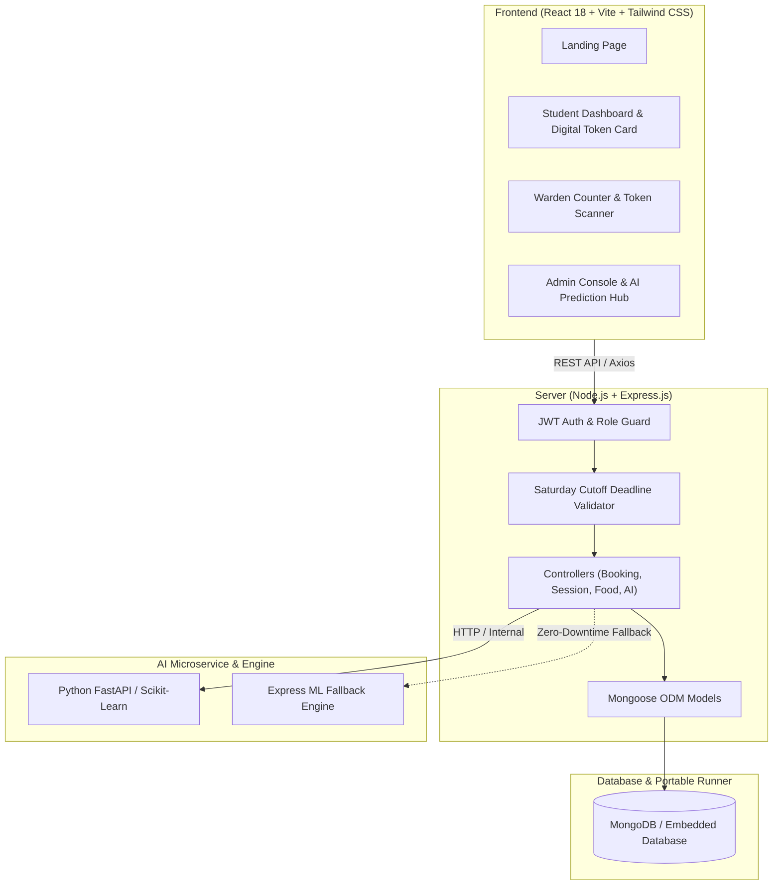

# SMART HOSTEL MESS MANAGEMENT & FOOD WASTE REDUCTION SYSTEM

An AI-driven, full-stack hostel dining platform featuring advance meal pre-booking, anti-duplicate digital mess tokens with QR codes, food waste tracking, and machine-learning meal demand forecasting.

Designed and engineered for university hostel dining facilities, B.Tech AI & Data Science capstone evaluations, and modern institutional catering operations.

---

## 1. Problem Statement & Objective

In standard college and university hostel messes, kitchen staff prepare meals based on guesswork and approximate student attendance numbers. This causes two chronic problems:
1. **Massive Food Wastage**: When students dine out or skip Sunday meals, large quantities of freshly prepared food are discarded.
2. **Food Shortages**: When turnout surges unexpectedly, late-arriving students face food shortages or compromise on quality.

### Solution & Objectives
- **Fixed Saturday Booking Window**: Students must pre-book their Sunday meal strictly between **Saturday 6:00 PM and 9:00 PM** (configurable by Admin).
- **Anti-Duplicate Digital QR Mess Pass**: Every booking generates an authenticated boarding-pass token (`SM-YYYY-XXXXXX`) with an encrypted QR code. Meals can be served only once.
- **AI Food Demand Prediction**: Predicts exact Veg and Non-Veg attendance from historical trends and computes optimal +5% buffer recommendations to eliminate waste without shortages.
- **Food Waste Tracking**: Records prepared vs. consumed quantities, calculates waste percentages, and generates audit reports.

---

## 2. System Architecture



---

## 3. Technology Stack

| Layer | Technologies |
|---|---|
| **Frontend** | React 18, Vite, Tailwind CSS, React Router v6, Lucide React, Recharts, QRCode.react, Canvas-Confetti, Axios |
| **Backend** | Node.js, Express.js, JWT, bcryptjs, express-validator, CORS, dotenv, morgan, mongodb-memory-server (zero-friction runner) |
| **Database** | MongoDB, Mongoose ODM |
| **AI / ML** | Python FastAPI, Scikit-learn Linear Regression, Pandas, NumPy + Node.js In-Process Statistical Predictor Fallback |

---

## 4. User Roles & Capabilities

### 1. Student
- Register & secure login with roll number and hostel email.
- Live countdown timer for the Saturday 6:00 PM – 9:00 PM pre-booking window.
- Select Sunday meal preference (**Vegetarian** or **Non-Vegetarian**).
- Generate a boarding-pass digital token card with an encrypted QR code.
- Switch meal preference or cancel before the Saturday 9:00 PM deadline.
- View complete historical meal passes and served timestamps.

### 2. Mess Warden
- Real-time attendance counters: Total Bookings, Veg, Non-Veg, Served, Pending, Cancelled.
- Fast student search by name, roll number, room, or token number.
- **Digital Token Scanner & Lookup**: Verify tokens via QR code or manual entry.
- **1-Click Mark as Served**: Prevents duplicate meal collection and logs warden ID & timestamp.
- **Log Food Waste**: Record prepared vs. consumed portions and view live waste percentages.
- **Export Reports**: Download CSV reports for student attendance and meal logs.

### 3. Chief Admin
- Complete analytics overview with Recharts: weekly booking volume, dietary split, food waste trends.
- **AI Demand Prediction Module**: Run Scikit-Learn regression models, inspect confidence scores, and view recommended preparation quantities with safety margins.
- **Booking Session Controller**: Create new sessions, advance/rollover weekly sessions, and toggle "Open Now (Demo Mode)" for instant evaluator demonstrations.
- Manage Students and Wardens.
- Update Sunday Mess Menu (Veg, Non-Veg, Dessert, and Kitchen instructions).
- Export comprehensive CSV and printable audit reports.

---

## 5. Demo Credentials

The database comes pre-seeded with 20 students, 2 wardens, 1 admin, 5 historical sessions, and an active session:

| Role | Email / ID | Password | Details |
|---|---|---|---|
| **Admin** | `admin@hostel.edu` | `Admin@123` | Chief Warden Dr. Ramesh Kumar (Full Access) |
| **Warden** | `warden1@hostel.edu` | `Warden@123` | Mr. Rajesh Sharma (Mess Warden Counter) |
| **Warden** | `warden2@hostel.edu` | `Warden@123` | Mrs. Sunita Verma |
| **Student** | `22ad001@hostel.edu` | `Student@123` | Aarav Patel (Roll: 22AD001, Room: A-201) |
| **Student** | `22ad002@hostel.edu` | `Student@123` | Diya Sharma (Roll: 22AD002, Room: B-104) |

> **Evaluation Tip**: A **Demo Quick-Switch Bar** is pinned to the top of the interface, allowing one-click switching between Student, Warden, and Admin views without retyping credentials.

---

## 6. Database Schema (Mongoose Models)

### `User`
- `name`: String
- `email`: String (Unique)
- `password`: String (Hashed with bcryptjs)
- `role`: enum `['student', 'warden', 'admin']`
- `rollNumber`: String (Student roll number, indexed)
- `roomNumber`: String
- `department`: String
- `year`: String
- `phone`: String
- `mealPreference`: enum `['veg', 'non-veg']`

### `BookingSession`
- `title`: String
- `weekOf`: String (e.g., `2026-W36`)
- `sundayDate`: Date
- `bookingOpen`: Date (Saturday 18:00)
- `bookingClose`: Date (Saturday 21:00)
- `status`: enum `['upcoming', 'open', 'closed', 'completed']`
- `isTestOverride`: Boolean (Enables demo mode)
- `menuDetails`: `{ vegItem, nonVegItem, dessert, specialNotes }`

### `Booking`
- `studentId`: ObjectId -> User
- `sessionId`: ObjectId -> BookingSession
- `mealType`: enum `['veg', 'non-veg']`
- `tokenNumber`: String (Unique, e.g., `SM-2026-000145`)
- `qrCodeData`: String (Data URL QR image)
- `status`: enum `['confirmed', 'cancelled']`
- `served`: Boolean (Default: false)
- `bookedAt`: Date
- `servedAt`: Date
- `servedBy`: ObjectId -> User (Warden)
- *Compound unique index on `(studentId, sessionId)` prevents duplicate bookings.*

### `FoodRecord`
- `sessionId`: ObjectId -> BookingSession
- `date`: Date
- `preparedQuantity`: Number (Veg + NonVeg)
- `servedQuantity`: Number
- `remainingQuantity`: Number
- `wastedQuantity`: Number
- `wastePercentage`: Number (`(wastedQuantity / preparedQuantity) * 100`)
- `recordedBy`: ObjectId -> User

### `Prediction`
- `sessionId`: ObjectId -> BookingSession
- `predictedVeg`: Number
- `predictedNonVeg`: Number
- `totalPrediction`: Number
- `recommendedVeg`: Number (With +5% buffer)
- `recommendedNonVeg`: Number (With +5% buffer)
- `confidence`: Number (e.g., 0.94)
- `algorithmUsed`: String

---

## 7. REST API Endpoints

### Authentication (`/api/auth`)
- `POST /api/auth/register` - Register a new student.
- `POST /api/auth/login` - Authenticate user & issue JWT token.
- `GET /api/auth/me` - Get current profile and attendance counters.
- `PUT /api/auth/profile` - Update student room number, phone, and meal preference.

### Bookings (`/api/bookings`)
- `POST /api/bookings` - Pre-book Sunday meal (enforces deadline & single booking rule).
- `GET /api/bookings/my` - Fetch current active booking and historical passes.
- `PUT /api/bookings/:id` - Change meal preference before deadline.
- `DELETE /api/bookings/:id` - Cancel meal booking before deadline.
- `GET /api/bookings` - Warden/Admin filtered search (by name, roll, room, status, meal).
- `PUT /api/bookings/:id/serve` - Warden marks meal as served (prevents double serving).
- `GET /api/bookings/token/:token` - Lookup booking by token string or QR payload.

### Sessions (`/api/sessions`)
- `GET /api/sessions/current` - Live session details and countdown target.
- `GET /api/sessions` - List all weekly sessions.
- `POST /api/sessions` - Create new weekly session.
- `PUT /api/sessions/:id` - Configure booking windows, menu, or toggle test mode.
- `POST /api/sessions/:id/reset` - Advance to next week's session.

### Analytics & AI (`/api/analytics`, `/api/prediction`, `/api/food`)
- `GET /api/analytics/dashboard` - Top metrics: bookings, dietary split, served rate.
- `GET /api/analytics/bookings` - 6-week historical booking trends.
- `GET /api/analytics/waste` - Food waste percentage trends over time.
- `POST /api/prediction` - Calculate meal demand and buffer recommendations.
- `GET /api/prediction/latest` - Latest prediction for active session.
- `POST /api/food` - Log meal preparation and waste portions.
- `GET /api/food` - Retrieve historical waste logs.

---

## 8. Installation & Setup Instructions

### Prerequisites
- Node.js (v18 or higher)
- npm (v9 or higher)
- Python 3.10+ (Optional for microservice; built-in ML engine works automatically)

### Step 1: Clone the Repository
```bash
git clone <repository-url>
cd Token
```

### Step 2: Backend Setup
```bash
cd server
npm install

# Start the server (Auto-connects to embedded MongoDB and auto-seeds demo data)
npm start
```
*Backend runs on `http://localhost:5000`.*

### Step 3: Frontend Setup
```bash
cd ../client
npm install

# Start Vite development server
npm run dev
```
*Frontend runs on `http://localhost:3000`.*

### Step 4 (Optional): Python AI Service
```bash
cd ../ai-service
pip install -r requirements.txt
uvicorn app:app --port 8000 --reload
```
*AI service runs on `http://localhost:8000`.*

---

## 9. Verification & Automated Testing

Run the included end-to-end test suite to verify all APIs, role permissions, deadline rules, token issuance, and duplicate serving prevention:

```bash
cd server
node test_e2e.js
```

---

## 10. Future Enhancements
- Automated WhatsApp/SMS booking cutoff reminder alerts.
- RFID/Biometric smart turnstile integration at the mess entry gate.
- Compost tracking and organic waste recycling metrics.
- Multi-hostel campus federation with central procurement analytics.
